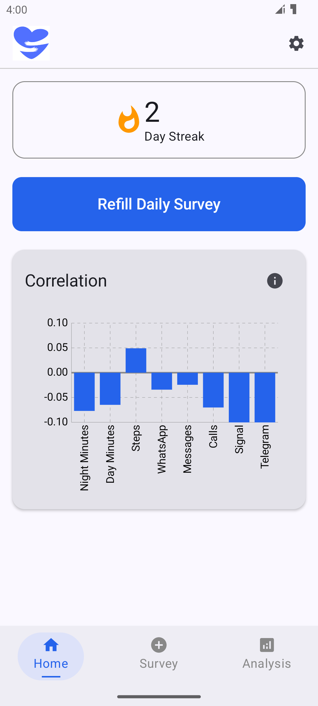
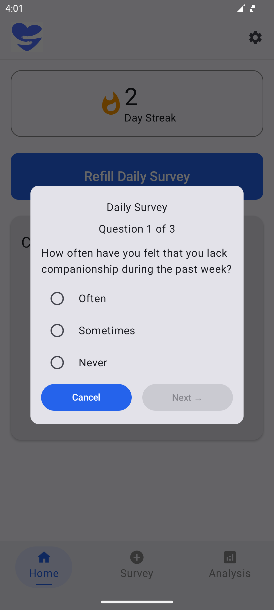
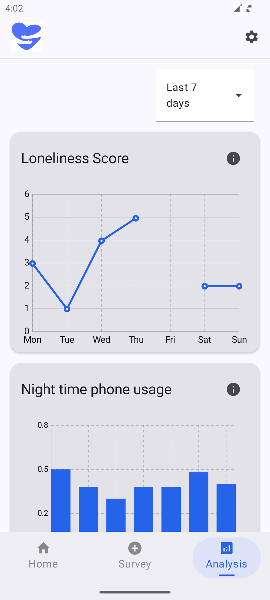
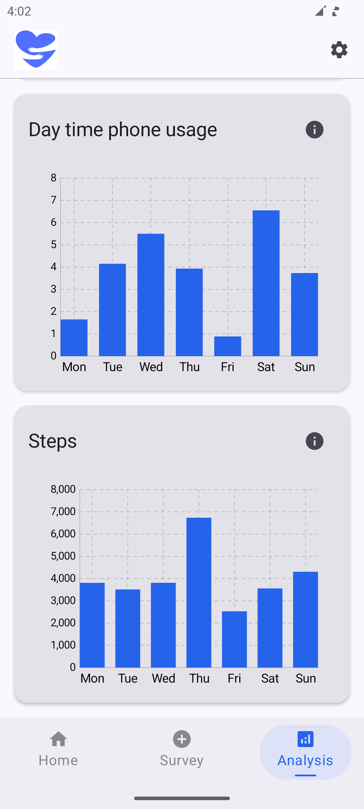
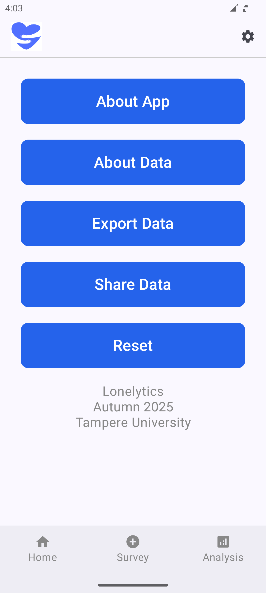

# Lonelytics

Lonelytics is a research and study project from Tampere University exploring the relationship between loneliness and mobile phone use. It lets you record loneliness with a short daily questionnaire and view charts and simple correlations alongside phone-use and activity measurements.

The app is not a medical device and does not provide diagnoses or treatment recommendations. If you have been feeling unwell or lonely for a long time, please contact healthcare services.

## Features

- Daily loneliness questionnaire and response streak
- Charts and simple correlation analysis
- Daytime and nighttime phone-use summaries
- Step counts and call-duration summaries
- Usage summaries for supported communication apps (WhatsApp and Telegram)
- Bluetooth proximity measurements
- CSV data export, sharing, and reset

## Install and run

### Requirements

- Android Studio with Android SDK Platform 36 installed
- JDK 17 for Gradle (Android Studio's bundled JDK is suitable)
- An Android device running Android 10 (API 29) or newer with Bluetooth Low Energy support

The app declares Bluetooth Low Energy as a required device feature. An emulator can be used to try the interface, but step counting and Bluetooth proximity measurements need suitable device hardware. The Gradle wrapper downloads the required Gradle version and dependencies; a separate Gradle installation is not needed.

### Run from Android Studio

1. Clone this repository:

   ```bash
   git clone https://github.com/bcsani/Loneliness-App.git
   cd Loneliness-App
   ```

2. Open the project directory in Android Studio and allow Gradle sync to finish.
3. Connect an Android device with USB debugging enabled, or start an emulator.
4. Select the `app` run configuration and click **Run**.

### Build and install from the command line

From the project root, build a debug APK:

```bash
./gradlew assembleDebug
```

The APK is written to `app/build/outputs/apk/debug/app-debug.apk`. To install it on a connected device with USB debugging enabled:

```bash
./gradlew installDebug
```

Alternatively, transfer the APK to the device and open it to install. You may need to allow installation from that source in Android settings.

## First launch and permissions

The app asks for permissions as needed. Some measurements will be missing if their permission is declined:

| Permission or setting | What it is used for |
| --- | --- |
| Activity recognition | Recording step counts |
| Call log | Calculating call duration totals; the app reads call duration and date, not call content |
| Usage access | Calculating phone-use periods and supported app-usage totals for WhatsApp and Telegram |
| Bluetooth and location | Scanning for nearby Bluetooth devices for proximity measurements |

Usage access is a special Android setting rather than a regular permission prompt. When prompted, choose **Open Settings**, find Lonelytics in the Usage Access list, and enable access. The exact labels and steps vary by Android version and device manufacturer. You can change app permissions later from Android's app settings.

## Using the app

- Complete the daily questionnaire from the home screen to record a loneliness score.
- Use the navigation controls to view the home and analysis screens.
- Open **Settings** to read the in-app information, export or share a CSV file, or reset the stored data. Reset permanently deletes the app's records and cannot be undone.

## Data and privacy

Survey answers and measurement summaries are stored in the app's local database on the device. The app has no project server that receives this data. Measurements can include questionnaire scores, step counts, call-duration totals, phone-use durations, supported messaging-app usage durations, and Bluetooth proximity summaries; the app does not collect message or call content.

CSV export and sharing are initiated by the user from Settings and pass the file to Android's chosen destination or sharing app. Android device backup settings may also affect local app data. Review the destination before sharing or exporting sensitive data.

## Screenshots

<p float="left">
  
  
  
  
  
</p>

## Development

Run the unit tests with the Gradle wrapper:

```bash
./gradlew test
```

To build a release APK, run:

```bash
./gradlew assembleRelease
```

The release APK is written to `app/build/outputs/apk/release/`. Release builds are not signed for distribution by this project, so configure your own signing credentials before publishing.

## License

See the [LICENSE](LICENSE) file for details.
